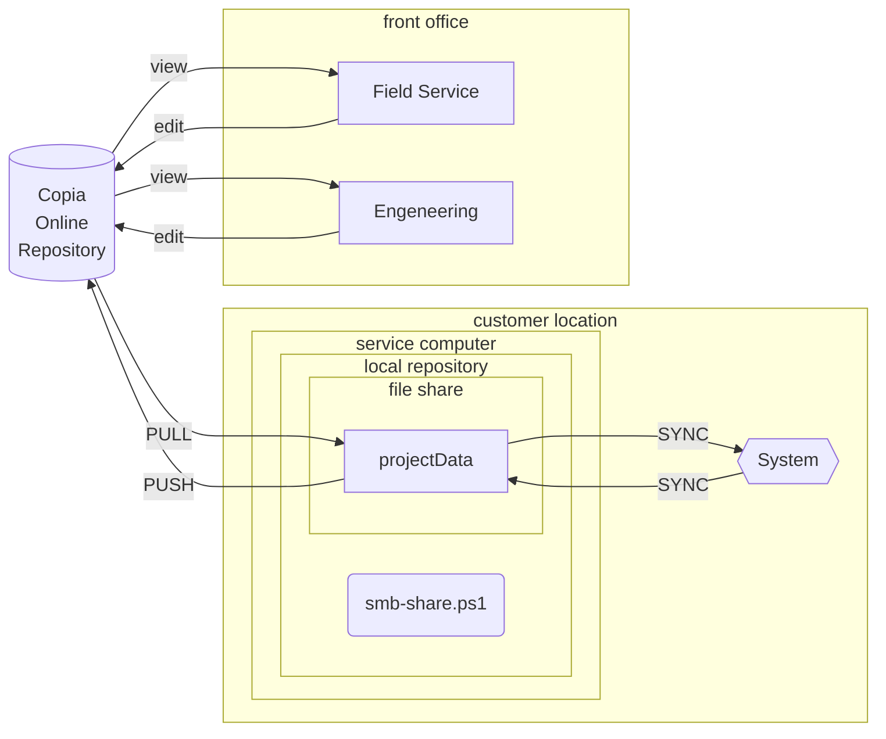

# **PLC Snapshot Feature Overview**

This document explains how to use the new snapshot feature added to our PLC programs. It is written for Test Line and Field Service teams. 

## **Quick Answer**

The HMI can now save two kinds of data to its SD card:

1. **IO Snapshots** – everything about every PLC channel, written to a brand new CSV file each time you take a snapshot.
    
2. **Setpoint Snapshots** – all configuration setpoints from both DFS and customer pages, written as additional rows in a single CSV file.
    

Both types of data are saved in safe folders on the HMI’s SD card.

---

# **Explanation and Full Description**

## **1. What This Feature Does**

We added a function to the PLC and HMI that lets us capture:

- Every channel’s IO configuration and status
    
- All DFS and customer setpoints
    

This is for troubleshooting, documentation, comparing units, and supporting field service investigations.

You do _not_ need to know how the PLC stores this internally. You only need to know how to trigger the save and where the files end up.



---

## **2. Why The SD Card Is Used**

We save everything to the **SD card inside the HMI** because:

- Nothing the programmer, Test Line, or Field Service can do from a laptop will accidentally format or wipe it.
    
- It stays with the machine even if the PLC program is updated.
    
- It gives us a simple, reliable place to store CSV files without risking system settings.
    

This SD card becomes our “black box recorder” for IO and setpoint snapshots.

---

## **3. Two Types of Snapshots**

### **A. IO Snapshots**

These contain all PLC channel data.  
For every channel we store:

- Description
    
- Label
    
- Settings
    
- Good state high / good state low
    
- Any other UDT-based values tied to that channel
    

When you take an IO snapshot:

- The HMI runs a JavaScript function
    
- That function pulls all channel data out of the PLC
    
- It writes it into a CSV file
    
- The CSV is saved into the SD card under:
    

```
/ioSnapshots/
```

**Important:**  
Each IO snapshot creates a _brand new_ CSV file.  
Every time you press “Save IO Snapshot,” you get another file.

Example filenames:

```
T0000015675_2025-11-12.csv
T0000015734_2025-11-12.csv
```

---

### **B. Setpoint Snapshots**

Setpoint snapshots store all configuration values from:

- **DFS Config page**
    
- **Customer Config page**
    

The HMI has a static, predefined list of tags it saves each time you hit the save button.  
These writes go to _one_ CSV file. Every new snapshot becomes another row inside that same file.

These are saved in:

```
/spSnapshots/
```

So instead of multiple files, you build a table of historical setpoints.

---

## **4. How Each One Organizes Data**

### **IO Snapshots**

- One file per snapshot
    
- Used for comparing units or checking wiring/config changes
    
- Easy to use with tools like FC, WinMerge, Notepad++, Excel
    

### **Setpoint Snapshots**

- One file for all snapshots
    
- Each save adds a row
    
- Good for tracking setpoint drift, mis-entry, or customer adjustments over time
    

---

## **5. How It Works Under the Hood (Plain English)**

You don’t need to be a programmer to understand the basics:

- The PLC stores IO channel configuration in a UDT
    
- The HMI runs a JavaScript command that reads all of those UDT values
    
- The HMI writes them into a CSV file
    
- The CSV files live on the SD card where they are safe

-blaaa

For setpoints:

- The HMI looks at a hard-coded list of tags
    
- Reads all those tag values
    
- Appends them to the setpoint CSV file
    

You never have to modify the script. You just use the HMI buttons we provide.

---

## **6. Folder Structure**

On the HMI SD card, in the root directory:

```
/ioSnapshots/   (IO data, new file per snapshot)
/spSnapshots/   (Setpoint data, all snapshots in one file)
```

Both folders are created automatically by the system.
