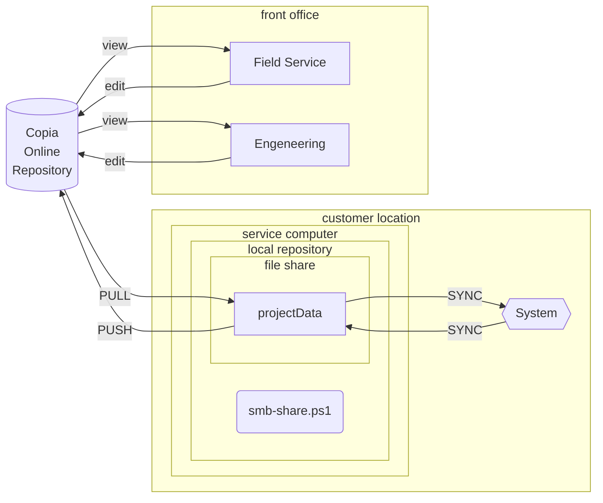

# **How To Use The Snapshot Feature for Configuration Work**

## **Quick Answer**

You can pull IO and setpoint snapshot files off the HMI in two ways:

1. **Pull the SD card and read the files directly.**  
    This is the easiest and most direct. It does not affect the PLC, but the HMI loses logging functions while the SD card is out.
    
2. **Set up a laptop as a Windows/Samba file share.**  
    This is more technical to set up the first time, but after that it's the fastest and cleanest way to work. Just plug in, hit Synchronize on the HMI, and all files move back and forth automatically.
    

The whole point of this feature is to let us build, edit, and restore complete configuration sets quickly using Excel instead of clicking through the HMI.

---

# **Explanation and Full Description**

## **1. Why This Feature Exists**

Programming builds the _default_ IO and setpoint data from our IOSheets.  
We already use VB tools in Excel to generate these CSVs.  
This snapshot functionality lets us:

- Export the actual live configuration from a system
    
- Edit it in Excel
    
- Restore it back into the machine
    
- Share configuration files between machines or service teams
    
- Load a brand-new system with correct defaults within seconds
    

Before this feature, every change had to be done through the HMI, which is slow and limited. Now the configuration is editable, portable, and far more complete.

CSV files are plain text, comma-separated, and Excel-friendly. Anyone can open, edit, and save them with no special tools.

---

## **2. Two Ways to Access the Snapshot Files**

---

# **Option 1: Pull the SD Card From the HMI**

### **This is the simplest and most direct method.**

**Steps:**

1. Power off the HMI.
    
2. Remove the SD card.
    
3. Put the SD card into your laptop.
    
4. Open the folders, edit the CSV files, save them.
    
5. Put the SD card back in the HMI.
    
6. Power the HMI back on.
    

### **What to Expect**

- This does _not_ affect the PLC program. The PLC keeps running fine.
    
- While the SD card is out, the HMI loses:
    
    - Alarm logging
        
    - Trending
        
    - Audit trail
        
- The HMI can still run, but it won’t be recording anything until the card is back in.
    
- After you reinsert the SD card, you must cycle power on the HMI again.  
    The HMI does not detect the card automatically.
    

### **Upside**

- Dead simple
    
- No networking needed
    
- Works anywhere
    

### **Downside**

- Takes the HMI down during the process
    
- Stops all logging while the SD card is removed
    
- Requires physically touching the machine
    

---

# **Option 2: Use a Windows/Samba File Share**

### **This takes a little setup once, but after that it is the fastest and most capable method.**

The idea is:  
**Your laptop pretends to be a little file server. The HMI syncs its files directly to it.**

### **Laptop Setup (One-Time Only)**

1. Set the Ethernet adapter to:
    
    - IP address: **33.7.0.243**
        
    - Subnet mask: **255.255.255.0**
        
2. Run the “file share setup” program provided by Programming.
    
3. This program creates a folder on your laptop called:
    
    ```
    Project Data
    ```
    
    (Capital D in Data)
    
4. It also makes that folder accessible as a network share automatically.
    

### **HMI Setup (One-Time Only)**

On the HMI’s networking page, enter:

```
\\33.7.0.243\Project Data
```

Test the connection. Once it passes, you’re good.

### **Daily Use**

Once both sides are set up, using it is extremely simple:

1. Plug your laptop into the system.
    
2. On the HMI, press the **Synchronize** button.
    
3. The HMI and your laptop compare their files:
    
    - If your laptop’s folder is empty, the HMI copies all snapshot folders into it.
        
    - If you edit a file on your laptop (in Excel), pressing sync copies it back to the HMI, overwriting the old version.
        

### **Why This Is the Best Method**

- No power cycles
    
- No opening the HMI enclosure
    
- All configuration files land directly on your laptop
    
- You can edit them instantly in Excel
    
- You can overwrite the HMI’s configuration in seconds
    
- Field Service can show up anywhere and pull the full system configuration immediately
    

This is the method you’ll want once you’ve set it up.

---

# **3. Why This Matters for Field Service and Test Line**

### **Fast Configuration Changes**

Instead of scrolling through HMI pages:

- Pull the CSV
    
- Open Excel
    
- Make changes
    
- Save
    
- Sync  
    Done.
    

### **More Powerful Than the HMI**

Some settings normally require a programmer to access.  
These snapshot CSVs include all that extra detail.

That means:

- Field Service can modify deeper system settings
    
- Test Line can reconfigure system defaults
    
- You’re not stuck waiting for Programming to send you an update
    

### **Universal Setup Using T-Numbers**

All files use the **T number** as their prefix.

Notes about T-numbers:

- Every system has exactly one T-number
    
- A T-number may include multiple D-numbers under it
    
- Because T-numbers are unique, they keep files organized
    
- When techs sync multiple systems, they end up with a collection of all configurations separated by T-number
    

This makes it easy to:

- Identify which system a file came from
    
- Track configuration drift
    
- Support multiple units in the field
    

---

# **Summary**

This snapshot system gives you a fast, reliable way to read and write system configurations.  
You can use either:

1. **SD card removal** – simplest, but takes the HMI offline.
    
2. **Samba file share** – more technical at first, but the best long-term solution.
    

Once set up, Field Service and Test Line can:

- Pull full configurations
    
- Edit them in Excel
    
- Push them back to the HMI
    
- Restore default data
    
- Move configs between systems
    
- Support customers quickly
    

All without touching the PLC program.

---

