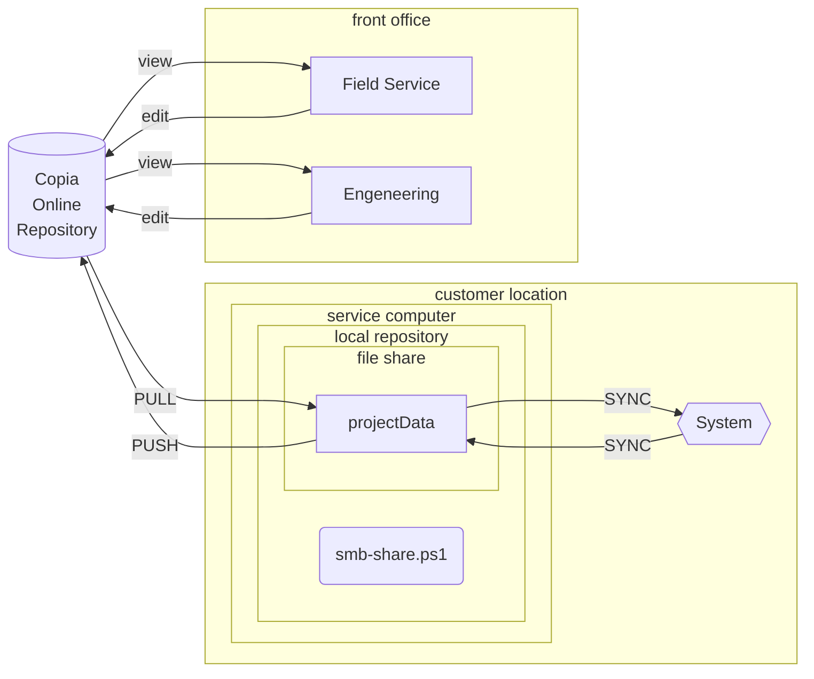
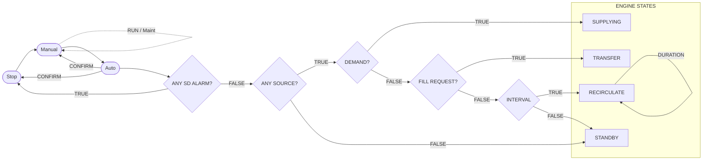

```mermaid
flowchart LR
    REPO[(Copia
          Online
          Repository)]

    subgraph customer location
        SYSTEM{{System}}
        subgraph service computer
            subgraph local repository
                SCRIPT(smb-share.ps1)
                subgraph file share
                    FOLDER[projectData]
                end 
            end
        end
    end

    SYSTEM -- SYNC --> FOLDER -- SYNC --> SYSTEM
    FOLDER -- PUSH --> REPO
    REPO -- PULL --> FOLDER
    
    subgraph front office
        FS[Field Service]
        ENG[Engeneering]
    end

    FS -- edit --> REPO
    REPO -- view --> FS

    ENG -- edit --> REPO
    REPO -- view --> ENG    
```

```mermaid
flowchart LR
  %% Primary engine modes
  STOP([Stop])
  MAN([Manual])
  AUTO([Auto])
  SOURCE{ANY SOURCE?}

  DEMAND{DEMAND?}
  FILL{FILL REQUEST?}
  TRANSFER
  ANYSD{ANY SD ALARM?}
  INTERVAL{INTERVAL}


  subgraph "ENGINE STATES"
    TRANSFER
    RECIRCULATE
    SUPPLYING
    STANDBY
  end


  %% Allowed transitions (per your rundown)
  STOP --> MAN
  MAN -. RUN / Maint .-> MAN
  MAN --> AUTO
  AUTO -- CONFIRM --> MAN
  AUTO -- CONFIRM --> STOP

  %% Forbidden transitions (shown as comments for clarity)
  %% STOP -x-> AUTO   // not allowed
  %% MAN  -x-> STOP   // not allowed per spec you gave


  AUTO --> ANYSD -- FALSE --> SOURCE
  SOURCE -- TRUE --> DEMAND
  SOURCE -- FALSE --> STANDBY

  DEMAND -- TRUE --> SUPPLYING
  DEMAND -- FALSE --> FILL
  FILL -- TRUE --> TRANSFER
  FILL -- FALSE --> INTERVAL


  ANYSD -- TRUE --> STOP


  INTERVAL -- TRUE --> RECIRCULATE
  INTERVAL -- FALSE --> STANDBY  
  RECIRCULATE -- DURATION --> RECIRCULATE


   


```
