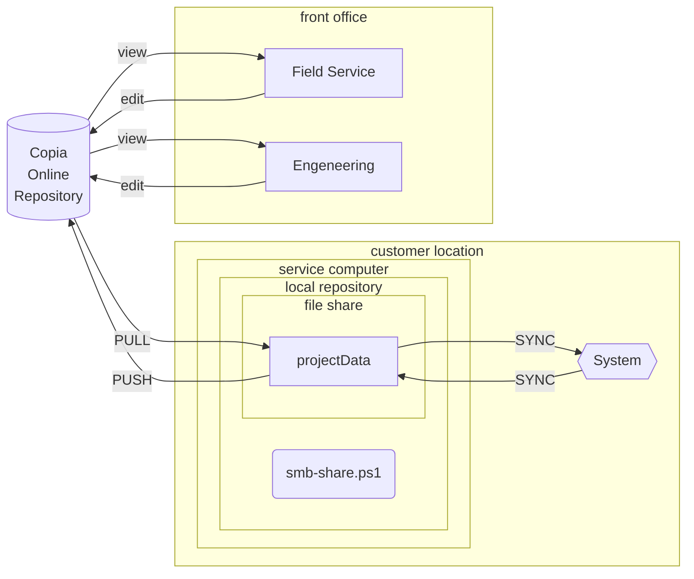

```mermaid
flowchart LR
    REPO[(Copia
          Online
          Repository)]

    subgraph customer location
        SYSTEM{{System}}
        subgraph service computer
            subgraph local repository
                SCRIPT(smb-share.ps1)
                subgraph file share
                    FOLDER[projectData]
                end 
            end
        end
    end

    SYSTEM -- SYNC --> FOLDER -- SYNC --> SYSTEM
    FOLDER -- PUSH --> REPO
    REPO -- PULL --> FOLDER
    
    subgraph front office
        FS[Field Service]
        ENG[Engeneering]
    end

    FS -- edit --> REPO
    REPO -- view --> FS

    ENG -- edit --> REPO
    REPO -- view --> ENG    
```